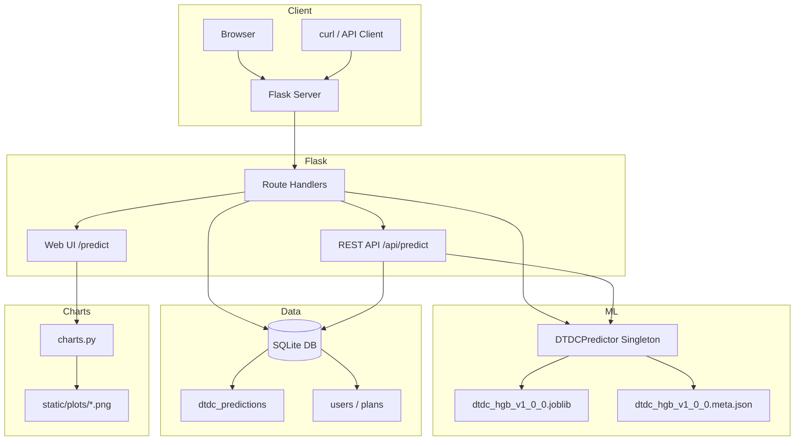

<div align="center">
  <h1>📦 CourierAI — AI-Powered Delivery Time Prediction</h1>
  <p>
    <strong>End-to-end machine learning platform</strong> for predicting shipment delivery times across Indian cities.<br>
    Trained on <strong>49,639 real courier records</strong>. Achieves <strong>MAE 0.54 days (≈13 hours)</strong> with a tuned HistGradientBoosting model.
  </p>
  <p>
    <a href="#-features">Features</a> •
    <a href="#-tech-stack">Tech Stack</a> •
    <a href="#-architecture">Architecture</a> •
    <a href="#-ml-pipeline">ML Pipeline</a> •
    <a href="#-installation">Installation</a> •
    <a href="#-api-documentation">API Docs</a> •
    <a href="#-deployment">Deployment</a>
  </p>
  <p>
    
    
    
    
    
  </p>
</div>

---

## 🧠 The Problem

Indian logistics companies handle millions of shipments daily across a network of cities, each with different transit modes (Surface, Express, Air Cargo), varying parcel profiles, and unpredictable delivery timelines. Customers and businesses need **accurate delivery estimates** to plan inventory, manage expectations, and keep operations efficient.

CourierAI is a production-ready ML system that predicts delivery duration **in days** from booking-time features — origin, destination, shipment mode, parcel weights, and booking weekday — trained on **49,639 real DTDC courier records** spanning **36 Indian cities**.

---

## ✨ Features

**Product**

- **🔮 ML-powered predictions** — tuned `HistGradientBoostingRegressor`, MAE 0.5361 days (≈13 hours) on a 20% hold-out set
- **🌐 REST API** — JSON API at `POST /api/predict` for integration into any logistics workflow
- **📊 Analytics dashboard** — live model KPIs (MAE / RMSE / R²), prediction volume, mode-impact and top-route charts
- **📝 Prediction audit log** — every prediction stored with full inputs, predicted value, model version, and a shareable tracking ID (`SCP-XXXXXXXX`)
- **🧭 Shipment tracking** — every prediction gets a computed journey timeline anchored to real elapsed time
- **🆚 Model comparison page** — production model vs. experiment-harness benchmarks (regression + classification)

**Platform & security**

- **👤 User accounts** — register / login / logout with Werkzeug-hashed passwords; timing-equalised login checks (no user enumeration)
- **🔑 API keys** — one per account, shown once, stored as SHA-256 hash **plus** a Fernet-encrypted copy for owner reveal; revocable and regenerable
- **💳 Plans & quotas** — Free (50 predictions/month), Pro ₹299/month, Pro+ ₹1,299/year (demo billing); enforced on both the API (HTTP `402`) and the web form
- **🛡️ OWASP hardening** — CSRF tokens on every state-changing form, security headers (CSP, `X-Frame-Options: DENY`, nosniff, HSTS), `SameSite=Lax` HttpOnly session cookies, open-redirect-safe `?next=` handling, session-fixation protection, stale-session cleanup
- **🚦 Rate limiting** — 30 req/min & 1,000 req/day per API key; 10/min logins; 5/min registrations; 3/hour key regenerations; Redis-ready backing store
- **🖥️ Admin console** — standalone walled-off panel (overview, demo mode, users & plans, analytics, system/ML + experiment lab), rate-limited and constant-time credential comparison
- **✅ Tested** — 36 integration tests, all passing

---

## 🚀 Live Demo

**👉 [https://smart-delivery-prediction.onrender.com](https://smart-delivery-prediction.onrender.com)**

> ⚠️ The free Render tier cold-starts in ~30–60 s after inactivity. Once loaded, requests are fast.

---

## 🛠️ Tech Stack

| Layer | Technology |
|---|---|
| **Backend** | Python 3.10+, Flask 3.0, Gunicorn |
| **Machine Learning** | scikit-learn (HistGradientBoosting), pandas, NumPy, joblib |
| **Experiment harness** | XGBoost, CatBoost, SVR, MLP, voting & stacking ensembles |
| **Database** | SQLite with self-healing schema migrations |
| **Visualization** | Matplotlib (dark-theme dashboard charts) |
| **Security** | Flask-Limiter, Werkzeug, cryptography (Fernet), CSP/security headers |
| **Deployment** | Render (`render.yaml`), Docker (`Dockerfile` + `docker-compose.yml`) |
| **Testing** | pytest — 36 integration tests |
| **Frontend** | Jinja2, CSS custom-property design system, vanilla JS (ES6), dark/light themes |

---

## 🏗️ Architecture



**Request flow:** input validation (type/length/bounds checks) → plan-quota check → model inference → audit-log insert with tracking ID → quota charged only after success.

---

## 🤖 ML Pipeline

### Dataset

- **Source**: DTDC Improved Dataset — **49,639 cleaned courier records** from a raw 44-column operational export
- **Target**: `delivery_duration_days` (actual delivery time)
- **Features**: 9 booking-time fields (no PII, no post-delivery data)
- **Coverage**: 36 Indian cities (Mumbai, Delhi, Bangalore, Kolkata, Chennai, Hyderabad, Pune, Ahmedabad, …)

### Preprocessing

| Step | Description |
|---|---|
| Unicode normalisation | NFKC on all categorical strings |
| Whitespace / case cleaning | Strip, collapse spaces, casefold |
| Validation | Reject missing/invalid weights, pieces, dates, non-positive targets |
| Deduplication | Drop exact duplicate rows |
| Date feature | Extract booking weekday |

### Features

| Feature | Type |
|---|---|
| `origin`, `destination` | Categorical (36 cities) |
| `booking_weekday` | Categorical (Mon–Sun) |
| `mode` | Categorical (Surface / Express / Air Cargo) |
| `nature_of_consignment` | Categorical (Dox / Non-Dox) |
| `total_pieces` | Numeric |
| `actual_weight`, `volumetric_weight`, `chargeable_weight` | Numeric (kg) |

Encoding: `OneHotEncoder(handle_unknown="ignore")` — unseen cities/modes never crash the model.
Numerics pass through (tree-based models are scale-invariant).

### Model Comparison

Production model, re-verified by retraining on the same 80/20 split (`random_state=42`):

| Model | MAE (days) | RMSE (days) | R² |
|---|---|---|---|
| **HistGradientBoosting (tuned, production)** | **0.5361** | **0.7263** | **0.7466** |
| 5-fold CV MAE | 0.5304 ± 0.0037 | — | — |

The full benchmark suite (`train_experiments.py`) additionally compares 5 base models (Random Forest, XGBoost, CatBoost, SVR/SVC, MLP) plus voting and stacking hybrids, for both **regression** (delivery days) and **classification** (delayed / on-time), runnable from the admin Experiment Lab or CLI.

### Hyperparameters (final model)

| Parameter | Value |
|---|---|
| `learning_rate` | 0.03 |
| `max_iter` | 150 |
| `max_depth` | 6 |
| `min_samples_leaf` | 20 |
| `l2_regularization` | 0.0 |
| `random_state` | 42 |

### Feature Importance (permutation, hold-out set)

Measured as MAE degradation (days) when the feature is shuffled — larger = more important:

| Feature | ΔMAE (days) |
|---|---|
| `mode` | 0.691 |
| `nature_of_consignment` | 0.231 |
| `total_pieces` | 0.222 |
| `actual_weight` | 0.134 |
| remaining features | < 0.01 |

**Key insight:** shipment mode dominates — ground (Surface) vs Express vs Air Cargo is the primary driver of delivery duration; route geography contributes surprisingly little once mode and parcel profile are known.

### Final Performance

| Metric | Value |
|---|---|
| Hold-out MAE | **0.5361 days (~12.9 hours)** |
| Hold-out RMSE | 0.7263 days |
| Hold-out R² | 0.7466 |
| 5-fold CV MAE | 0.5304 ± 0.0037 days |
| Train time | ~2 s (49,639 rows) |
| Inference (end-to-end wrapper) | ~7 ms / prediction |
| Artifact size | 564 KB joblib |

---

## 📁 Project Structure

```
smart-delivery-prediction/
├── app.py                      # Flask app, routes, auth, security (~1,900 lines)
├── dtdc_model.py               # Production model: preprocessing, training, DTDCPredictor
├── train_experiments.py        # Base/hybrid/stacking benchmark harness (admin + CLI)
├── config.py                   # Env-driven configuration, plans, validation bounds
├── database.py                 # SQLite access layer + self-healing migrations
├── charts.py                   # Matplotlib chart generation
├── schema.sql                  # Database schema
├── ml_model.py                 # Legacy synthetic model (tests only)
├── seed_data.py                # Synthetic demo seeder (tests only)
├── requirements.txt / pytest.ini / render.yaml / Dockerfile / docker-compose.yml
│
├── data/
│   └── dtdc_preprocessing.py   # Dataset cleaning pipeline (pure, no model deps)
├── models/
│   ├── dtdc_hgb_v1_0_0.joblib      # Production artifact (564 KB, committed)
│   └── dtdc_hgb_v1_0_0.meta.json   # Version, hyperparameters, metrics
├── static/
│   ├── css/app.css             # Design system (tokens, components, themes)
│   ├── js/app.js               # Theme, nav, live-summary, toasts
│   └── plots/                  # Generated at runtime (git-ignored)
├── templates/                  # 22 Jinja2 pages + shared partials
├── tests/
│   └── test_delivery.py        # 36 integration tests
└── docs/screenshots/           # Live UI captures (1440×900)
```

---

## 📦 Installation

```bash
# 1. Clone
git clone https://github.com/suman2308/Delivery-time-prediction.git
cd Delivery-time-prediction

# 2. Virtual environment
python -m venv .venv
.\.venv\Scripts\Activate.ps1      # Windows (PowerShell)
source .venv/bin/activate         # macOS / Linux

# 3. Dependencies
pip install -r requirements.txt

# 4. (Optional) Retrain the model — needs DTDC_Improved_Dataset.csv in the root
python -m dtdc_model train

# 5. Run
python app.py                     # http://127.0.0.1:5000
```

The committed model artifact means **no training is required** to run the app.

### CLI

```bash
python -m dtdc_model train    # train from CSV
python -m dtdc_model predict  # interactive prediction

# Batch via JSON lines:
echo '{"origin":"Mumbai","destination":"Pune","booking_weekday":"Monday","mode":"Surface","nature_of_consignment":"Dox","total_pieces":1,"actual_weight":0.5,"volumetric_weight":0.8,"chargeable_weight":0.5}' | python -m dtdc_model predict
```

### Experiments

```bash
python train_experiments.py --scope smoke     # 600 rows, ~30 s sanity check
python train_experiments.py --scope quick     # 5,000 rows, ~2 min
python train_experiments.py --scope reduced   # full data, 6 paradigm-covering stack combos
python train_experiments.py --scope full      # full data, all 17 combos
```

### Tests

```bash
pytest    # 36 tests
```

---

## 📡 API Documentation

### `POST /api/predict`

**Auth required** — `X-API-Key: scp_live_…` header (or `Authorization: Bearer …`).
Register to get a key (shown once, revealable/copyable from the Account page; stored hashed + encrypted). Keys are revoked instantly on regeneration.

**Rate limits:** 30/min and 1,000/day per key → HTTP `429`.
**Plan quota:** Free = 50 predictions/month (resets on the 1st) → HTTP `402` when exhausted; Pro/Pro+ unlimited.

```bash
curl -X POST http://127.0.0.1:5000/api/predict \
  -H "Content-Type: application/json" \
  -H "X-API-Key: scp_live_YOUR_KEY" \
  -d '{
    "origin": "Mumbai",
    "destination": "Pune",
    "booking_weekday": "Monday",
    "mode": "Surface",
    "nature_of_consignment": "Dox",
    "total_pieces": 1,
    "actual_weight": 0.5,
    "volumetric_weight": 0.8,
    "chargeable_weight": 0.5
  }'
```

**Response `200`:**

```json
{
  "predicted_time_days": 3.8444,
  "model_version": "1.0.0",
  "algorithm": "HistGradientBoostingRegressor",
  "tracking_id": "SCP-4F2A9B1C"
}
```

**Errors:** `400` validation (e.g. `{"error": "Origin and destination cannot be the same city."}`) · `401` missing/invalid key · `402` quota exhausted (`{"plan", "limit", "used"}` in body) · `429` rate limited · `503` model unavailable.

Input validation is defensive: strings are length-capped, weights must be finite and positive (≤ 1,000,000 kg), pieces 1–10,000, and same-city routes are rejected.

### `GET /health`

```json
{ "status": "healthy" }
```

### `GET /metrics`

```json
{
  "mae_days": 0.5361,
  "rmse_days": 0.7263,
  "r2": 0.7466,
  "model_version": "1.0.0",
  "algorithm": "HistGradientBoostingRegressor",
  "training_date": "2026-07-30T05:47:29.862381+00:00"
}
```

---

## 🔐 Admin Console

Reachable only via the standalone login at **`/admin-login`** (footer link). Default demo credentials — **change via `ADMIN_LOGIN_EMAIL` / `ADMIN_LOGIN_PASSWORD` before any public deployment**:

```text
email:    admin@gmail.com
password: 00000000
```

The console is a **walled-off session**: an admin is confined to admin endpoints (public and user pages bounce back to `/admin`), and registered accounts can never become admins. Five server-rendered sections:

- **Overview** — total/active users, predictions today, paid subscriptions, system status
- **Demo Mode** — enable sample data; reset deletes only demo rows
- **Users & Plans** — every account with plan, usage, and prediction totals
- **Analytics** — platform-wide KPIs, charts, recent predictions
- **System & ML** — model version/status, API & DB health, measured prediction latency, and the **Experiment Lab** (runs `train_experiments.py` in-process with crash-resume progress files)

Login is rate-limited (10/min), CSRF-protected, and compared in constant time.

> **Note:** the Experiment Lab needs `DTDC_Improved_Dataset.csv` (24 MB, git-ignored) in the project root. Container deployments without it report a `FileNotFoundError` in the lab only — predictions and everything else work.

---

## 🔧 Environment Variables

| Variable | Default | Description |
|---|---|---|
| `PORT` | `5000` | Server port |
| `FLASK_DEBUG` | `0` | Enable Flask debug mode |
| `SECRET_KEY` | auto-generated, persisted to `instance/secret_key` | Session-signing secret; a known default is **never** used. Set explicitly in production |
| `KEY_ENCRYPTION_KEY` | derived from `SECRET_KEY` | Optional separate Fernet key for API-key encryption |
| `DELIVERY_DB_PATH` | `delivery.db` | SQLite database path |
| `FREE_PLAN_LIMIT` | `50` | Monthly free-plan prediction quota |
| `DTDC_DATA_PATH` | `DTDC_Improved_Dataset.csv` | Dataset path for the experiment harness |
| `ADMIN_LOGIN_EMAIL` | `admin@gmail.com` | Admin console login (**change in production**) |
| `ADMIN_LOGIN_PASSWORD` | `00000000` | Admin console password (**change in production**) |
| `COOKIE_SECURE` | `0` | `1` = session cookies sent only over TLS |
| `TRUST_PROXY` | `0` | `1` behind a trusted proxy (Render/nginx) — keys rate limits per real client IP |
| `RATE_LIMIT_STORAGE_URI` | `memory://` | Use `redis://…` when running multiple workers |
| `API_RATE_LIMIT` | `30 per minute` | Per-key prediction rate limit |
| `API_RATE_LIMIT_DAILY` | `1000 per day` | Per-key daily cap |
| `LOGIN_RATE_LIMIT` | `10 per minute` | Login attempts per IP |
| `REGISTER_RATE_LIMIT` | `5 per minute` | Registrations per IP |
| `REGENERATE_KEY_RATE_LIMIT` | `3 per hour` | API-key regenerations per account |

> The DTDC model path is managed internally by `dtdc_model.py` (versioned artifact + companion metadata).

---

## ☁️ Deployment

### Render

1. Push the repo to GitHub.
2. In the [Render Dashboard](https://dashboard.render.com): **New + → Blueprint** → select the repo.
3. Render picks up `render.yaml`:
   - Build: `pip install -r requirements.txt`
   - Start: `gunicorn app:app --bind 0.0.0.0:$PORT --workers 2 --timeout 120`
4. Set `SECRET_KEY` (Render can auto-generate) and the admin credentials.

The production model artifact is committed, so **no model setup is needed at deploy time**.

### Docker

```bash
docker compose up --build
```

---

## 🖼️ Screenshots

Live captures at 1440×900 — full gallery in [`docs/screenshots/`](docs/screenshots/):

| Home | Predict | Tracking | Admin |
|---|---|---|---|
|  |  |  |  |

---

## 🔮 Roadmap

- [ ] **Geographic clustering** — group cities by region for better generalization to unseen routes
- [ ] **Real-time features** — weather and traffic APIs for live-adjusted predictions
- [ ] **SHAP explanations** — per-prediction feature attributions
- [ ] **Automated retraining** — CI/CD that retrains on fresh data and hot-swaps artifacts
- [ ] **Interactive charts** — Plotly/D3 instead of static Matplotlib PNGs
- [x] **Docker support** — Dockerfile + docker-compose.yml
- [x] **CI/CD** — GitHub Actions test pipeline on every push
- [x] **User authentication & profiles** — hashed passwords, editable profile with avatar
- [x] **API keys & rate limiting** — hashed + encrypted per-user keys, per-key limits
- [x] **Plans & quotas** — Free (50/month), Pro ₹299/mo, Pro+ ₹1,299/yr
- [x] **Experiment lab** — admin-runnable base/hybrid/stacking benchmarks feeding the comparison page
- [x] **OWASP hardening** — CSRF, CSP and security headers, hardened cookies, open-redirect defences

---

## 📄 License

Distributed under the **MIT License**. See [`LICENSE`](LICENSE).

---

<div align="center">
  <sub>Built with Python, Flask, scikit-learn & modern CSS</sub><br>
  <sub>© 2026 Suman Jash</sub>
</div>
